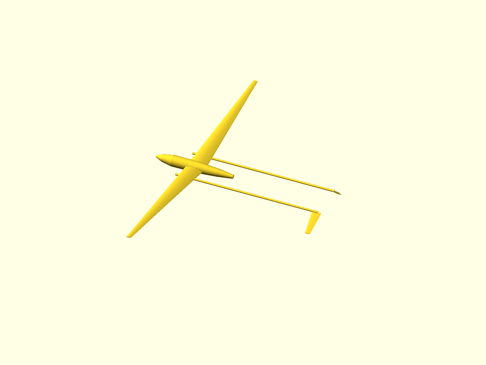
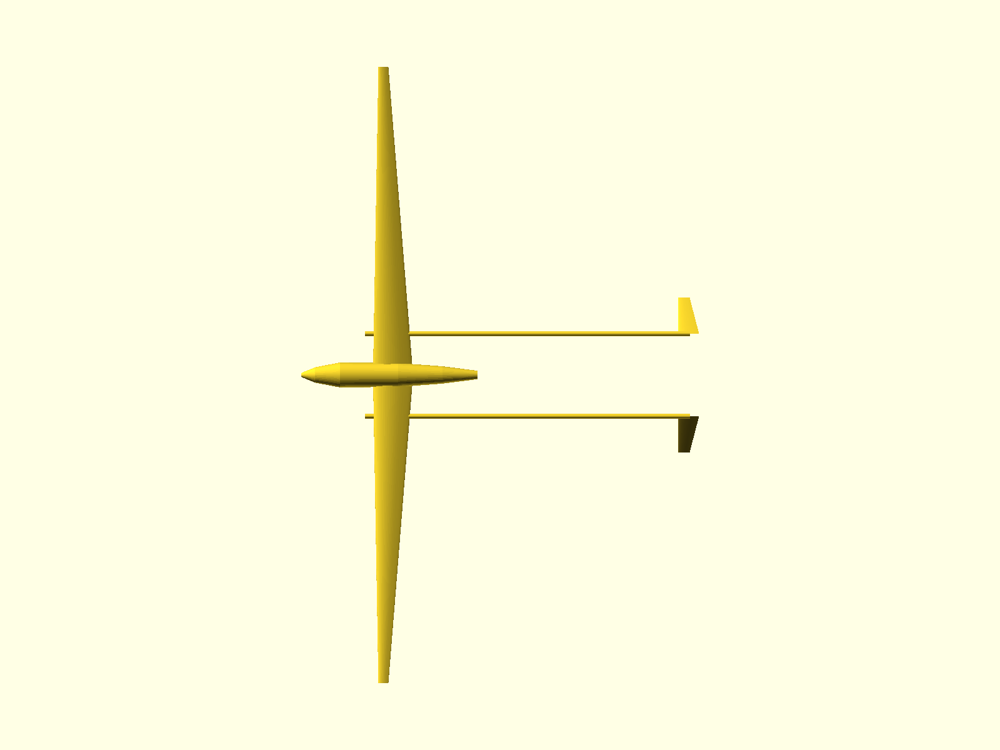
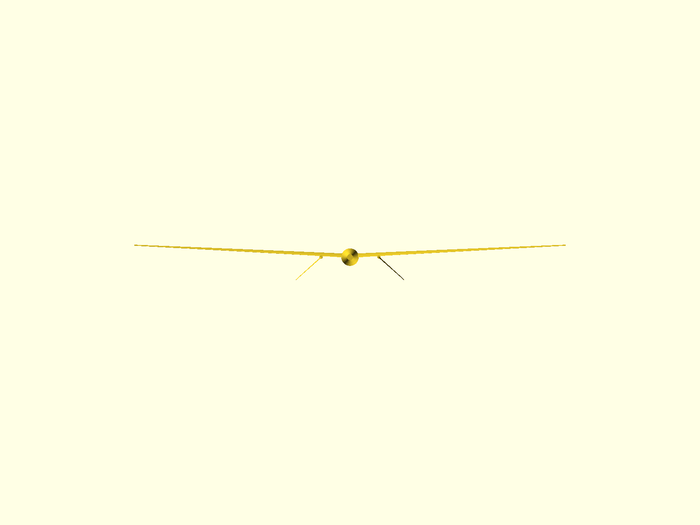
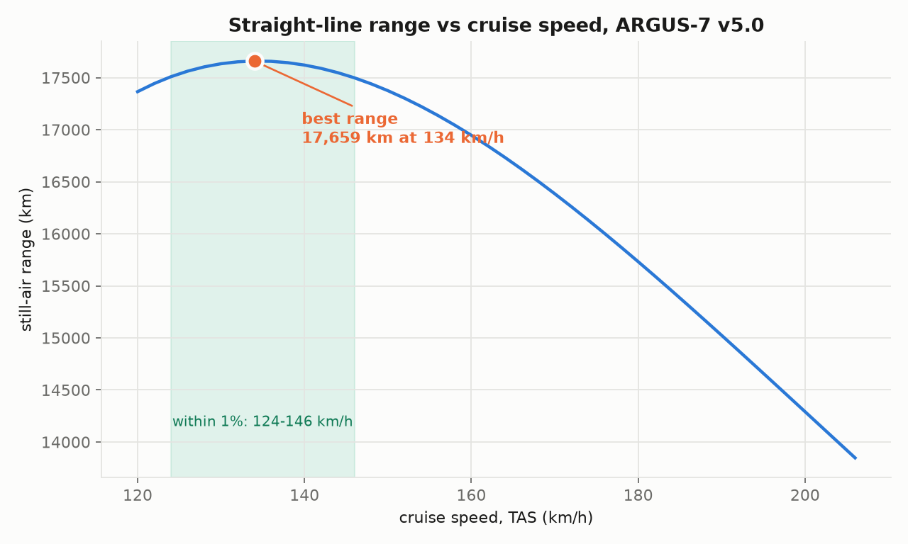
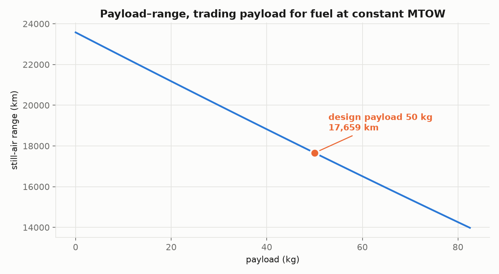

Clude and Kimi decided to have a drone baby over night from som questions i asked in group chat about a project kimi swarm chewed over. Seems to be fairly well optimized airframe. Maybe usefull for someone, or maybe its just garbage.

# ARGUS-7 — Persistent Disaster-Zone Communications & Survey UAV

Long-endurance fixed-wing UAV carrying a 50 kg multi-role bay (LTE/5G relay +
EO/IR gimbal + mesh/satcom backhaul) over a disaster zone, recovered by parachute
and airbag for reuse.

**Status:** paper design with a reproducible model behind it. Nothing flight-tested,
no CFD, no structural test. 459 tests pass; 12 xfails document real defects in the
published design rather than broken tests.

## The aircraft



| | |
|---|---|
|  |  |

**v5.0** — 6.97 d loiter, 320 kg MTOW, 11.86 m span, 5.72 m² wing at AR 24.6,
10.85 kW engine driving a 1.04 m two-blade propeller at 2050 rpm through 3.66:1.
Static margin +12.72% full / +13.68% dry. **Passes 8 of 9 adoption gates** — G7
(buildability) fails because its 251 g/kWh full-load BSFC is a design *target*,
not a verified figure for any engine on the report's shortlist; the nearest
verified units are 330 g/kWh.

The wing sits at 41% of fuselage length, not the 22% the published design used.
That single change is what makes it balance, and it also puts the tanks at the CG,
so CG travel across the whole fuel burn is +0.94% MAC.

Renders regenerate from `design/argus7_v5.yaml` via `scripts/build_model.py`.
**These depict a paper design that has never been built or flown**, and
`docs/argus7_v3_premortem.md` lists what would have to be true for it to fly.

## Performance

Two different missions, two different speeds. Endurance flies at minimum *power*;
range flies at minimum *drag*. You do not get both from one flight.

| | Loiter mission | Ferry mission |
|---|---|---|
| **Endurance** | **166.6 h (6.94 d)** | 131.8 h |
| **Range** | — | 17,659 km **(not currently flyable — see below)** |
| Speed | ~102 km/h TAS | 134 km/h TAS |
| Best-range band | — | 124–146 km/h (within 1%) |
| L/D max | 30.4 at C_L 1.028 | |



The range optimum sits *faster* than textbook L/D would put it, because BSFC
depends on engine load fraction — cruising harder works the engine into a better
part of its curve.

**What 17,659 km reaches**, from a mid-Europe base: Lisbon 19%, New York 37%,
Tokyo 44%, Cape Town 56%, Sydney 86%. Earth's circumference is 227% — no.

**Sanity check:** Vanilla VA001's 8-day world record at 191 kg is roughly
19,300 km of air distance if flown straight, so this is the same order as a real
aircraft of the class. It is *not* the discredited 16,000 km claim from the
originating session revived — that was 200 kg on BSFC 230 g/kWh with no stall
margin; this is 320 kg on ~310 g/kWh part-load with the stall margin active.

**The range figure is not flyable with the propeller as specified.** Reaching
134 km/h at MTOW needs 2,500 prop rpm, i.e. 9,148 crank rpm through the 3.66:1
reduction — **122% of the assumed 7,500 rpm rating**. The fixed-pitch disc was
selected for the loiter point and tops out near 122 km/h at MTOW, leaving much of
the installed power unusable in cruise. The loiter mission is unaffected. This is
the case where the earlier "variable pitch buys nothing" conclusion stops holding:
it was true for loiter, and is false for the ferry mission.

**Other caveats:** still air (a 30 km/h headwind costs 22% of range); no reserve,
climb, descent or diversion, fuel burned to dry tanks; and 102 km/h does not close
at MTOW — the loiter speed only becomes available once fuel has burned off.
Regenerate with `scripts/range_analysis.py`.



## Start here

- **[docs/decisions/](docs/decisions/)** — what was found, decided and corrected,
  with the reasoning and the cost of being wrong for each.
- **[docs/argus7_design_report.md](docs/argus7_design_report.md)** — the original
  v1.0 report. **Superseded**: it publishes a statically unstable aircraft. Kept as
  the historical record.
- **[design/](design/)** — the design points. See the lineage below.

## Design lineage

These are not variants of one aircraft; they are successive corrections.

| File | Endurance | Status |
|---|---|---|
| `argus7_v1.yaml` | 4.70 d published, **3.16 d** measured | **Published, defective.** Statically unstable (−44% → −82% MAC), wing cannot hold its fuel, propeller cannot absorb its engine |
| `argus7_v2.yaml` | 4.88 d | **RETIRED.** Unstable (−8.7% → −23.5%), mass budget 13 kg short |
| `argus7_v3.yaml` | 6.33 d | **Superseded.** Balances, but at +5.79% MAC — below the spec's own 8% floor |
| `argus7_v4.yaml` | 6.99 d | **Superseded.** Balances, but span 12.001 m against a 12.0 m limit — zero buildable margin, fails gate G3 |
| `argus7_v5.yaml` | **6.94 d** | **Current. 8/9 gates** — G7 fails on an unverified engine BSFC. Span 11.856 m (144 mm margin), SM +12.72% / +13.68%, mass closes exactly |

Every design point is machine-checked: geometry closure, provenance tags on every
parameter, and a static-margin verification against `argus7/analysis/balance.py`.

## The five findings that moved the numbers

1. **The engine is the biggest lever, not the airframe.** v1.0 installs 17 kW for
   climb, then loiters at 3.4 kW — **19% load, where BSFC is 425 g/kWh, not the
   assumed 270**. Right-sizing to ~11 kW is worth more than every aerodynamic
   refinement combined.
2. **The aircraft did not balance, and nobody had checked.** Static margin
   −44% MAC at full fuel. The report's published "+14.7% at CG 42%" does not
   reproduce; the *neutral point* half of that same line does, so the 42% CG was an
   assumed target no mass build-up supports. Fixed by moving the wing station from
   `x_le_frac` 0.22 to ~0.42.
3. **The wing could not hold its own fuel.** 101.5 kg required against 66 kg of
   capacity. Fixed by a larger, thicker wing — which also buys spar depth, so empty
   mass barely moves.
4. **The propulsion set did not close.** A 0.813 m prop at 2100 rpm needs
   C_P = 0.911 against a ~0.25 ceiling. It was a symptom of the oversized engine:
   at 11 kW an ordinary 1.04 m two-blade prop absorbs it comfortably.
5. **Aspect ratio is not the lever the design was built around.** Span efficiency
   is nearly flat in AR (0.989 at AR 14 to 0.969 at AR 30, measured across 45 AVL
   runs), so the only real cost of aspect ratio is structural mass.

## Layout

```
argus7/
  design/    parameter schema, geometry derivation, closure guards
  cad/       aerofoil coordinates, build123d model, STEP/STL/OpenSCAD export
  aero/      XFOIL driver, NeuralFoil surrogate, component drag build-up
  prop/      engine power and part-load BSFC, BEMT propeller
  mission/   ISA atmosphere and the batched differentiable mission simulator
  opt/       design space, mass model, geometry coupling, layout, optimiser
  analysis/  CG, neutral point, static margin (AVL-cross-checked)
research/    materials, riblets, boom construction, empennage trade, hypotheses
docs/decisions/   rulings, findings, gauntlet pre-registration and audit
scripts/     setup_env.sh, build_model.py, optimiser runs, mutation_test.py
opt_runs/    raw output of every optimisation run
```

## Reproducing

```bash
./scripts/setup_env.sh                      # xfoil, avl, gmsh, calculix, SU2, openscad, venv
PYTHONPATH=. .venv/bin/pytest tests/ -q     # 459 pass, 12 xfail
PYTHONPATH=. .venv/bin/python scripts/build_model.py    # regenerate CAD from design/argus7_v1.yaml
PYTHONPATH=. .venv/bin/python scripts/mutation_test.py  # test the tests
```

The mission simulator reproduces the closed-form Breguet solution to **0.0000%**
and the published v1.0 endurance to **+0.2%**. It runs 40 M designs in 4.6 s on a
12 GB GPU with exact gradients through the fuel-burn integration.

## Figures

| Path | Status |
|---|---|
| `figures/cad/` | v1.0 renders, regenerated by `scripts/build_model.py` |
| `figures/cad_v2/` | v2.0 renders — **v2.0 is retired**, kept only for comparison |
| `figures/argus7_3view.png`, `argus7_performance.png` | v1.0 era, from the originating session. **Not regenerable** — the code did not survive |
| `figures/design-pack/fig1`–`fig9` | The 200 kg AR-20 predecessor, a different aircraft. **Not regenerable** |
| `figures/final/` | v5.0 renders, regenerated by `scripts/build_model.py` |
| `figures/current/` | Static margin, part-load BSFC, endurance, drag split, range, payload–range — all regenerated by `scripts/make_figures.py` and `scripts/range_analysis.py` |

## Known gaps

- **The MTOW scaling law is not determined.** Three fits of the same quantity give
  exponents 0.869, 0.998 and 1.452 depending on the subset. Only engine power scales
  cleanly (MTOW^0.82, 6.1% scatter) because climb pins it; span, area and aspect
  ratio scatter 20–31% because the objective is genuinely flat in those directions.
  See [docs/decisions/2026-08-21-scaling-not-determined.md](docs/decisions/2026-08-21-scaling-not-determined.md).
- **Report §2's tail row does not close:** V_h is 0.5765, not the stated 0.68.
  Tracked as an xfail.
- **Two of the report's three sensitivity anchors are wrong:** BSFC 250 gives
  +0.377 d, not +0.5 d; 3,000 m gives +0.198 d, not +0.23 d. Only the C_D0 anchor
  reproduces.
- **The performance analysis behind the v1.0 report is not reproducible** — the code
  did not survive the originating session. The CAD and the current mission model are.
- **The endurance case rests on a BSFC measurement nobody has made.** 335 g/kWh at
  ~31% load is modelled, not dyno-mapped.
- Model limits on every endurance number: pure loiter only (no transit, climb or
  reserve), fuselage fixed at 3.4 m, non-wing airframe mass fixed at 28 kg
  regardless of wing size, mass model calibrated on a single point.
- Regulatory treatment is EU headline level only, and the current design point sits
  **above** the 250 kg band the original occupied.

## Verified non-issues

- **Propeller/boom clearance.** The booms sit outboard of the prop disc and move
  outboard automatically with wing span, because `booms.y_station_frac` is a
  fraction of semi-span. Clearance is 169 mm on v1.0 and improves on later points.
- **The booms are not in the propwash.** An earlier revision of this file claimed
  they were. They clear the contracted slipstream by 183–209 mm, giving a vibratory
  strain of 0.011% against a 0.6% matrix fatigue limit — a 55× margin. The design
  action is a prohibition (no structure inside r = 0.45 m aft of the disc), not a
  layup constraint.
- **Wing thickness at 20%** costs +15.8% on wing profile drag and *raises* C_Lmax
  from 1.868 to 1.973. Measured on the real coordinates, not assumed.
