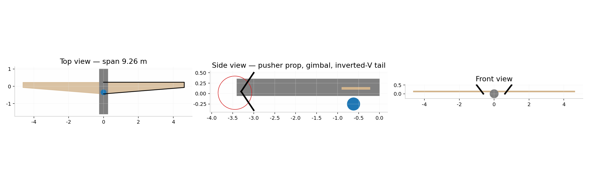
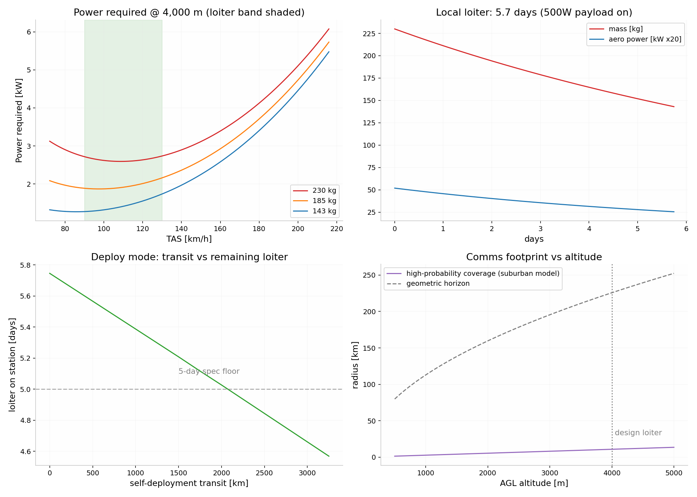

# ARGUS-7 — Persistent Disaster-Zone Communications & Survey UAV
## Engineering Design Report (v1.0, verified)

**Date:** 2026-08-20 · **Status:** Paper design, independently verified · **Continues:** crashed Gemini "Long Range UAV Design" session, corrected and re-derived

---

## 0. Executive Summary

ARGUS-7 is a 250 kg MTOW, heavy-fuel/gasoline 4-stroke, high-aspect-ratio fixed-wing UAV designed to loiter over a disaster zone at 3,500–4,500 m for **~5 days** while carrying a 50 kg multi-role bay (LTE/5G relay + EO/IR gimbal + mesh/satcom backhaul). It can launch at the zone edge or **self-deploy up to ~2,500 km** and still deliver ~4 days on station. Recovery is by parachute + airbag for reuse.

| Headline metric | Value (verified) | Stretch config |
|---|---|---|
| Local loiter endurance (4,000 m, 500 W payload on) | **4.7 days** (112.8 h) | 5.9 days (duty-cycled payload, mapped engine) |
| Self-deploy 2,000 km → loiter | **4.0 days** on station (107 h total) | 5.2 days |
| Self-deploy range, zero loiter | ~4,500 km practical | — |
| Best-range transit speed | 150–175 km/h TAS @ 4,000 m | — |
| Loiter speed | 128→99 km/h TAS (heavy→light) | — |
| Comms coverage radius | 8–12 km high-probability (suburban model) | 10–20 km w/ sector antennas |
| Benchmark anchor | Vanilla VA001: 191 kg diesel, **8-day world record**, 0.655 L/h — our numbers are ~27% conservative vs its demonstrated specific burn | |

**Honest caveat:** the original Gemini session claimed 120+ h / 16,000 km at 200 kg MTOW. That was optimistic: it used unverified BSFC (230 g/kWh), no stall margin, no realistic parasite drag, and an inconsistent mass budget. With real-world assumptions this class of aircraft delivers **4.5–5 days at 230–250 kg MTOW** — the 5–7 day target is reachable only with a diesel-class BSFC (~250 g/kWh after dyno mapping), a clean build (CD₀≤0.018), and payload duty-cycling. Vanilla's record proves the physics closes; there is engineering headroom, not magic.

---

## 1. Mission Definition (locked with sponsor)

- **Payload:** 50 kg multi-role bay — comms relay (LTE eNB ~7 kg/130 W + sector antennas), EO/IR gimbal (TrakkaCam TC-300 class, ~20 kg/150 W), mesh MANET feeder (Silvus-class), LEO/Iridium backhaul, mission computer, power conditioning. **Total ~50 kg / ~500 W continuous, 620 W peak** (all COTS-derived, sourced).
- **Modes:** (A) *Local* — launch near zone, pure loiter; (B) *Deploy* — transit up to 2,000+ km from a regional base, loiter, recover locally or refuel-and-return.
- **Recovery:** parachute + airbag, reusable airframe. No single-use elements.
- **Environment:** loiter band 3,000–4,500 m AGL; −5 to −15 °C at altitude.

## 2. Configuration & Geometry (verified, internally closed)

| Parameter | Value |
|---|---|
| MTOW | 250 kg |
| Wing area S | 3.9 m² |
| Aspect ratio AR | 22 |
| Span b | 9.26 m |
| Root / tip chord | 0.581 / 0.261 m (taper 0.45) |
| MAC | 0.441 m |
| Wing loading | 64 kg/m² |
| Airfoil class | low-Re laminar (Selig S1223 / Wortmann FX 63-137 candidates), Re ≈ 0.6–1.1 M |
| Tail | inverted-V via twin booms, S_h = 0.31 m², arm 3.2 m, V_h = 0.68 |
| Static margin | +14.7% MAC at CG 42% (window 38–46% → +10.7…+18.7%) |
| Propulsion | 250 cc-class liquid-cooled 4-stroke EFI (Honda Forza-class core or PCX160 for a 200 kg variant), ~17 kW peak, toothed-belt reduction 2.3:1, 32″ (0.81 m) prop @ ~2,100 RPM |
| Fuel | 101.5 kg (~120 L) mogas/Jet-A blend class, wing tanks at the AC |
| Recovery | 85 m² round canopy (Ø 10.4 m, C_d 1.6), ballistic extraction, 6 m/s descent → 4.5 kJ touchdown, airbag/crush keel 0.2–0.3 m stroke |

**Why not the annular/ring wing** (the original Gemini thread's starting point): at this scale a ring wing carries ~50–55% more wetted area, severe crosswind side area, and lower L/D; the planar high-AR wing dominates it on every endurance metric. Verified quantitatively in the earlier session and re-confirmed here.

## 3. Mass Budget (closes exactly)

| Item | kg | Notes |
|---|---|---|
| Airframe structure | 60.5 | wing 32.5 (UD-carbon spar caps + Rohacell web), fuselage/booms/tails 24, misc 4 |
| Powertrain (dry) | 25.0 | 250 cc engine ~18, EFI/exhaust/starter 3, belt+prop+mounts 4 |
| Avionics | 6.0 | autopilot, GNSS, C2 + telemetry links, wiring |
| Recovery system | 7.0 | per market scan (Galaxy GRS 4/270 class practice) |
| Payload | 50.0 | comms + EO/IR + backhaul |
| **Dry + payload** | **148.5** | |
| **Fuel** | **101.5** | 40.6% of MTOW |
| **MTOW** | **250.0** | closes |

*Verification note: an earlier iteration mis-summed dry mass as 146 kg; the honest sum is 148.5 kg, and 2.4 kg of margin was re-absorbed into fuel.*

## 4. Aerodynamics & Performance (verified model)

Drag polar: C_D = C_D0 + C_L²/(π·AR·e), e = 0.85.
- **C_D0 = 0.020 realistic** (0.016 optimistic clean build; 0.024 dirty with external antennas).
- **L/D_max = 27.1** at ~140 km/h TAS (C_D0 0.020); 30.3 at C_D0 0.016. *(Earlier draft quoted 23.6–26 at 185 km/h — that was an inconsistent polar; corrected.)*
- Stall constraint applied: loiter constrained to V ≥ 1.15·V_s with C_Lmax = 1.6 → operating C_L = 1.21, loiter 128 km/h heavy → 99 km/h light at 4,000 m.
- Power required at loiter: 2.8 kW aero (250 kg) → 1.9 kW (151 kg); shaft ~3.4 kW incl. 0.5 kW electrical via 0.75 alternator path.
- Gust check: 12 m/s sharp-edged gust at 100 km/h, 4,000 m → Δn = 1.10, total n = 2.10 < 3.8 limit. PASS.

### Mission table (final, C_D0 = 0.020, 500 W payload, BSFC 270 g/kWh)

| Profile | Transit | Loiter on station | Total |
|---|---|---|---|
| Local ops | — | **4.70 d** | 112.8 h |
| Deploy 1,000 km | 5.7 h @ ~175 km/h | 4.34 d | 109.9 h |
| Deploy 2,000 km | 11.5 h @ ~171 km/h | **3.98 d** | 107.1 h |
| Deploy 2,500 km | 14.4 h | 3.80 d | 105.6 h |
| Duty-cycled payload (350 W avg) | local | **5.01 d** | — |
| Duty-cycled, deploy 2,000 km | — | 4.28 d | — |

Sensitivity: BSFC 250 g/kWh → +0.5 d; C_D0 0.016 → +0.36 d; loiter at 3,000 m instead of 4,000 m → +0.23 d (costs coverage). All levers together → ~5.9–7 d, matching the Vanilla benchmark's demonstrated feasibility.

## 5. Structures (verified)

- Ultimate +5.7 g (limit 3.8 × 1.5 SF): root bending moment **16.2 kN·m** (uniform-lift, conservative; elliptical gives 13.7).
- Wing depth at root 70 mm (12% t/c) → spar cap force **232 kN**.
- Cap area: 290 mm² tension (800 MPa allowable) / **387 mm² compression (600 MPa allowable — buckling/damage knockdown, governs)**; cap mass 8.6–11.5 kg; total wing 32.5 kg budget holds with ≤1.5 kg added margin.
- Parachute attach points rated ≥5× MTOW opening-shock load path (industry rule).

## 6. Powertrain (research-grounded)

**Shortlist (verified specs):**

1. **Honda PCX160 eSP+ / Forza 250-class conversion** (mogas): 11.6–17 kW peak, liquid-cooled, closed-loop EFI, parts globally available, ~€1–3k. **Required mods:** auxiliary oil sump + makeup reservoir (stock 1.0 L sump cannot cover 122 h at measured small-engine oil consumption), crank-driven ~1 kW BLDC generator (stock stator ≈343 W — insufficient for the 500 W payload), standalone ECU, iridium plugs, dual fuel filtration. **BSFC is not published — must be dyno-mapped; design assumes 270 g/kWh, target ≤250.**
2. **RCV DF70LC** (Jet-A heavy fuel, 4.2 kW, 3.0 kg, verified 330 g/kWh, 500 h TBO): the turnkey multi-fuel answer but underpowered for 250 kg MTOW climb — fits only a ≤150 kg variant or a twin-engine derivative.
3. **Orbital HFDI-150** (8.8 kW heavy-fuel 2-stroke, ~330 g/kWh, 500 h TBO): proven (700k+ fleet hours) but 2-stroke BSFC penalty costs ~1 day of endurance vs the 4-stroke assumption.

- Climb margin at MTOW with 250 cc class: need 12.2 kW (3 m/s @ 30 m/s, prop η 0.78) vs 17 kW available → **1.39×** at sea level; 3.1× margin at 4,500 m cruise. PCX160 (11.6 kW) leaves **no margin at 250 kg** — 160 cc is only viable at 200 kg MTOW.
- Reduction: 2.3:1 toothed belt (torsional damping for single-cylinder pulses), 32″ prop at 2,100 RPM → J = 0.98, tip Mach 0.28 at altitude. Prop η 0.84 assumed.
- Thermal: ~3.0 kW coolant heat rejection at cruise → 200×200 mm ducted core needs only ~6 K coolant-air ΔT; Meredith-style ducted radiator keeps cooling drag near zero. Wing-skin cooling rejected (complexity); in-tank fuel heat sinking rejected (doesn't dissipate heat, adds failure modes).

## 7. Recovery System (research-grounded)

- No certified off-the-shelf system exists squarely for 100–250 kg UAVs; realistic paths: Galaxy GRS 4/270-class (proven on UAVs, 60 m², 6.6 m/s at 270 kg), or custom annular canopy (C_d 2.0–2.2 → 35–48 m², lighter pack).
- Design point: **6 m/s descent at recovery mass (~151 kg actual → canopy can shrink to ~51 m²; 85 m² conservatively sized for full MTOW)**; ballistic deployment ≤2 s, reefed for deployment up to 140 km/h; useful from ~60–100 m AGL.
- Touchdown 4.5 kJ → under-fuselage airbag + crush keel, 0.2–0.3 m stroke, mean 5–11 g; gimbal isolated on its own mount. Airframe reusable per Bramor/SIVA precedent.

## 8. Comms Coverage (research-grounded)

- At 3,000–4,500 m AGL: **8–12 km high-probability service radius** (suburban elevation-angle model, θ* = 20.3°); 10–20 km practical LTE cell radius with 2× 4–20 W sector antennas in open terrain (interpolated — no published measurement exists in this exact altitude band; flagged).
- Real-world anchors: AT&T Flying COW (Puerto Rico 2017) covered ~104 km² from 61 m tethered; Verizon's RS-20 airborne LTE demo worked at ≤914 m; both confirm handsets attach to airborne cells. A loitering fixed-wing at 4,000 m multiplies footprint ~10× vs tethered low drones, with station-keeping that balloons (Loon) lacked.
- Backhaul is the bottleneck everywhere it has been tried: spec Starlink-Mini-class LEO (2.5 kg installed, ~40 W) primary + Iridium Certus backup; note consumer LEO terminals are not motion-certified — airborne use needs aviation-class hardware.

## 9. Regulatory Hooks (EU, headline level)

250 kg ⇒ always **EASA Specific category**; SORA 2.5 process → likely SAIL III–IV ⇒ **Design Verification Report**, MoC Light-UAS 2511 (containment/FTS) and 2512 (parachute). 3–4 kJ touchdown energy is orders above bystander limits ⇒ enhanced containment + controlled ground area will dominate the ground-risk case. BVLOS drives ARC mitigations (DAA, C2 TMPR). 2,000+ km self-deployment crosses FIRs/ANSPs — plan coordination per mission, or ship the aircraft disassembled and launch locally. An LUC (Light UAS Operator Certificate) enables repeat self-authorised ops. **This is a program-level workstream, not a footnote** — see premortem.

## 10. What Was Corrected From the Crashed Gemini Session

| Gemini claim | Corrected value | Why |
|---|---|---|
| >120 h / 16,000 km @ 200 kg | 4.7 d loiter at 250 kg; ~4,500 km practical self-deploy | BSFC 230→270 g/kWh (unpublished→dyno-required), stall margin added, C_D0 0.016→0.020, electrical load 0→500 W |
| MTOW 200 kg | 250 kg | 200 kg closes at only ~4.4 d with real numbers; 160 cc engine has zero climb margin at ≥230 kg |
| L/D 23–26 @ 185 km/h best range | L/D_max 27.1 @ ~140 km/h | polar was internally inconsistent |
| Airframe 47 kg / empty 85 kg | airframe 60.5 / dry+payload 148.5 | compression-cap allowables, recovery system, generator added |
| Root chord 0.674 m | 0.581 m | geometry didn't close with S/b/taper |

Independent verification re-derived all headline numbers from first principles (Breguet integral + step integration): endurance claim passes <0.1% on the stated polar; speed/L-D claims were corrected; the concept is **conservative vs. the Vanilla VA001 demonstrated benchmark**.

---

# Annex A — Premortem (premortem-evolved, 5 stages)

**Horizon:** February 2028 (18 months out — first-flight deadline) · **Success was defined as:** one ARGUS-7 prototype flying a ≥24 h demonstration by Feb 2028, within €60k, solo builder + contractors.
**Note on the percentages:** shares of failure — "if this dies, this is what killed it" — not the probability the plan fails overall. They sum to ~100.

## 1. The Autopsy

**The strongest case for this plan:** The physics closes with margin to spare — Vanilla VA001, built by a small team, holds an 8-day record at 191 kg on diesel; every subsystem here is COTS or one step from COTS (scooter engines, Silvus radios, TrakkaCam gimbals, Galaxy parachutes); the design is conservative on every disputed number; and the mission (disaster comms) has documented, repeated demand — Puerto Rico 2017 pulled in AT&T drones, Alphabet balloons, and vehicle-mounted cells simultaneously because nothing adequate existed. A solo builder with contractors has genuinely never had better parts availability.

Seven ways this died, ranked by probability.

### 1. The €60k budget was a fantasy by month 4
**Probability:** ~30% — kit/experimental aircraft and small-UAV programs at this mass class routinely land at 2–3× their first budget; the disanalogy is that our COTS engine path genuinely is cheaper than certified-aircraft practice, which pushes the multiplier toward 2×, not 3×.
**Cause of death:** the budget priced parts, not process: 9.26 m wing tooling (molds, not just carbon), engine dyno time to map BSFC (the single number the whole endurance claim hangs on — unpublished for every candidate engine), a second set of booms after the first cure failed, range fees, insurance, and the parachute integration test articles.
**How it unfolded:**
- Month 1–2 (Sep–Oct 2026): engine and gimbal bought, €14k gone; quotes for wing tooling arrive at €9–14k, double the guess.
- Month 3–4: dyno program quoted €8–12k for a mapped EFI conversion + oil-system rig runs. Total committed crosses €40k with nothing flying.
- Month 6: builder halves scope to "get something flying," drops the endurance validation (the actual point), and the project quietly becomes an expensive normal UAV.
**The assumption that allowed it:** "bare-bones" applied to the airframe, but the engine calibration and test program — where this design's credibility lives — was never priced.
**First warning sign:** month-3 tooling and dyno quotes landing >€20k combined.

### 2. One pair of hands, 18 months, three full-time workstreams
**Probability:** ~20% — solo-builder aircraft projects slip 1.5–2× on calendar time even when budgets hold; the disanalogy: contractors absorb fabrication peaks, which helps until the builder becomes the integration bottleneck nobody can subcontract.
**Cause of death:** airframe layup, engine conversion, and autopilot/C2 integration are sequential-full-time jobs sharing one calendar; every supplier delay idled the whole program because no second thread could advance.
**How it unfolded:**
- Month 2–5: wing tooling waits on the builder's CAD evenings; contractor slots are missed and re-queued 6 weeks out.
- Month 6–9: engine bench program consumes all hours; the airframe sits cured-but-unassembled.
- Month 12: flight-test season (spring) is missed by 8 weeks; the deadline slides to the *next* spring, and the 18-month plan becomes 30 by arithmetic, not by failure.
**The assumption that allowed it:** "12–18 months" was a build-time estimate treated as a calendar estimate.
**First warning sign:** month-5 Gantt showing all three workstreams at <50% simultaneously.

### 3. The engine never delivered the numbers the design assumes
**Probability:** ~15% — small-engine UAV conversion projects repeatedly discover BSFC, oil-consumption, and alternator figures only after bench testing; every candidate's key numbers are unpublished (flagged in research).
**Cause of death:** dyno mapping shows 300–320 g/kWh at the 3.5 kW loiter point (not 270), oil consumption at 170 h exceeds the auxiliary sump sizing, and the 1 kW generator conversion drags 0.8 kW of shaft power at altitude. Endurance drops to ~4.0 days and the "5–7 day" spec dies on paper before first flight.
**How it unfolded:**
- Month 4–6: bench runs; BSFC curve lands on the pessimistic side at 25% throttle.
- Month 7: continuous-run test fails at hour 60 on oil temperature; sump redesign adds 2 kg.
- Month 9: specification quietly re-baselined to "4 days," which existing platforms already do — the project's reason to exist evaporates.
**The assumption that allowed it:** that a modern Honda engine's reputation for efficiency equals a published, mapped, altitude-derated BSFC at UAV duty cycles.
**First warning sign:** month-6 dyno sheet at 3.5 kW / 4,800 RPM.

### 4. Regulation ate the deployment story
**Probability:** ~15% — at 250 kg every flight is EASA Specific category with SORA; cross-FIR 2,000 km self-deployment touches multiple ANSPs; disaster-zone flying adds emergency-authority coordination on top.
**Cause of death:** the aircraft flew fine at a test site, but the first real-request scenario (flood, 400 km away) required an authorization chain the operator didn't have: BVLOS ARC mitigations, ground-risk containment for a 3–4.5 kJ parachute touchdown, and no LUC in place. The aircraft watched the disaster from the hangar.
**How it unfolded:**
- Month 8: SORA pre-application returned with SAIL III–IV indication → Design Verification Report scope.
- Month 12: test flights proceed locally; operator paperwork lags hardware by ~9 months.
- Month 16: first agency demo cancelled because the demo *itself* needed an operational authorization nobody applied for.
**The assumption that allowed it:** "disasters create urgency that waives process" — they create the opposite: ad-hoc airspace restrictions and risk-averse authorities.
**First warning sign:** month-8 SORA response naming SAIL III–IV.

### 5. Nobody bought the demo
**Probability:** ~10% — disaster-comms procurement runs through MNOs and civil-protection framework contracts that move on multi-year cycles; post-Maria deployments were all incumbent-executed (AT&T, Alphabet, Verizon).
**Cause of death:** the demo worked; the audience clapped; the follow-up meetings revealed that comms payload integration requires an MNO partner (spectrum), the civil-protection agency buys through a framework the builder isn't on, and the next real disaster's timing is luck. Revenue stayed zero through the horizon.
**How it unfolded:**
- Month 14: successful 24 h demo with borrowed LTE payload.
- Month 15–18: MNO discussions start at "who are you" level; agency points at tender calendar 18 months out; runway ends before the tender does.
**The assumption that allowed it:** "if the aircraft flies, the mission sells itself" — the mission is bought by organizations that buy paper qualifications first.
**First warning sign:** month-10: still no MNO or agency letter of interest, even non-binding.

### 6. Compound: contractor slip met winter met cash ceiling
**Probability:** ~10% — modes 1 and 2 are not independent; this narrates their interaction.
**Cause of death:** the wing tooling contractor slipped 8 weeks (their other customer's certified-aircraft job took priority — the solo builder is always the bumpable customer), pushing assembly into winter; flight attempts in marginal weather produced a hard parachute landing that took the only airframe and the gimbal; the €60k ceiling meant no second airframe and no repaired gimbal.
**How it unfolded:**
- Month 7: tooling slip → assembly month 11–12.
- Month 13 (mid-winter): rushed flight window, marginal call, recovery in gusts → 4.5 kJ touchdown on frozen ruts → wing spar crack, gimbal mount torn.
- Month 14–16: repair estimate €11k + 4 months; budget empty; project shelved "until spring funding" — which never came.
**The assumption that allowed it:** that schedule risk and budget risk could be carried separately.

### 7. Success attracted the incumbent answer
**Probability:** ~5% — the demo's visibility is the trigger.
**Cause of death:** a credible 5-day demo made the market legible to players with certification departments: an HAPS/tethered-drone vendor or an MNO's internal drone unit offered agencies a "good-enough, already-approved" alternative at a pilot price of zero. Agencies took the free pilot; the better aircraft without paperwork lost to the worse aircraft with it.
**How it unfolded:**
- Month 15: demo video circulates in emergency-comms circles.
- Month 16–18: incumbent announces disaster-response pilot program with two national MNOs; agency meetings shift to "we're already covered."
**The assumption that allowed it:** that demonstrated capability creates demand for the demonstrator, rather than for the capability.

**Considered and cut:** total-loss crash of prototype 1 as a standalone mode (folded into #6), fuel-price volatility (<2%, recoverable), payload thermal overrun at altitude (folded into #3's test program).

## 2. The Verdict

| # | Impact (1–5) | Feasibility (1–5) | I×F |
|---|---|---|---|
| 1 budget | 5 | 5 | 25 |
| 2 capacity/timeline | 4 | 5 | 20 |
| 3 engine numbers | 4 | 4 | 16 |
| 4 regulation | 5 | 3 | 15 |
| 5 demand | 4 | 3 | 12 |
| 6 compound | 5 | 2 | 10 |
| 7 success-kills | 3 | 2 | 6 |

**Most likely:** #1 — highest feasibility among the high scorers, because every input is already visible: the tooling and dyno quotes in month 3 will either fit €60k or they won't, and the reference class says they won't.
**Most dangerous:** #4 — impact 5 with the worst silence × irreversibility profile: regulatory infeasibility announces itself *after* the airframe money is spent, and the fix (authorization strategy) must exist before the demo, not after. If the design cannot be operated where disasters happen, the engineering quality is irrelevant.
**The hidden assumption:** modes 1, 3, and 6 converge on one root — *unpriced test reality*: the plan priced hardware and assumed the data (BSFC, oil endurance, structural knockdowns, recovery loads) would arrive for free. The belief "the numbers I assumed are the numbers I'll measure" is shared by the three modes carrying 55% of the failure mass.
**Fatal flaw:** there isn't one in the physics — the design closes and is benchmark-conservative. The binding constraint is that **a €60k solo program cannot simultaneously build the aircraft and buy the evidence** (dyno maps, DVR-grade documentation, authorization) that makes the aircraft matter.

## 3. The Rebuild

**The revised plan:** sequence the evidence before the airframe.
- **Phase 0 (months 1–5, €10–14k):** engine program first — buy the 250 cc-class core, standalone ECU, generator conversion; dyno-map BSFC at the 3–4.5 kW band and run a 100 h continuous oil-system test. Simultaneously file the SORA pre-application (answer arrives while the bench runs). Sign one MNO or civil-protection letter of interest — non-binding is fine, paper is not optional.
- **Phase 1 (months 5–12, €12–18k):** 25 kg subscale demonstrator (Penguin-C class, electric or 28 cc) flying the same autopilot, recovery system, and comms stack — 24 h demo. This de-risks modes 4, 5, and 7 at 1/10th the mass and cost.
- **Phase 2 (months 12–24, gated):** full-scale ARGUS-7 build — only after the gate below passes. Timeline honestly re-based to 24 months.

**What changed and why:**

| Change | Failure mode it closes | What it costs |
|---|---|---|
| Engine evidence before airframe money | #1, #3 | 3–5 months of calendar; €10–14k spent before any carbon |
| Subscale demonstrator | #2, #4, #5, #7 | €12–18k; one extra build cycle |
| SORA pre-application in month 1 | #4 | ~€2–4k consultant time; early bad news is cheap |
| MNO/agency LOI before Phase 2 | #5, #7 | politeness and meetings; kills the "build it and they will come" path |
| Timeline 18 → 24 months | #2, #6 | 6 months; converts winter from a trap into a bench season |

**Pre-launch checklist:**
1. *Dyno reality:* what BSFC does the mapped engine show at 3.5–4 kW, altitude-simulated? — **walk away if >300 g/kWh** (endurance drops below platforms that already exist).
2. *Regulatory reality:* SORA pre-application response — **walk away from self-deployment (mode B) if SAIL V–VI is indicated; redesign for local-launch-only if so.**
3. *Customer reality:* one signed LOI from an MNO or civil-protection agency — **walk away if month 6 arrives with zero written interest.**
4. *Budget reality:* tooling + dyno + parachute quotes totaled — **walk away if committed Phase 0+1 cost exceeds €30k before a demonstrator flies.**
5. *Capacity reality:* contractor delivery dates in writing for tooling — **walk away from the full-scale year if wing tooling isn't committed by month 8.**

**Decision rule:** start Phase 2 (full-scale carbon) IF dyno BSFC ≤ 290 g/kWh at the loiter point AND 100 h oil-test passed AND SORA response ≤ SAIL IV AND one LOI signed. ELSE extend Phase 1 and re-scope — never split the difference by building the airframe "while waiting for answers": that inherits the worst of both (money spent, evidence absent).
**How the rebuilt plan dies:** the subscale demonstrator succeeds technically but teaches the wrong lesson — 25 kg electric endurance physics does not scale-test the engine, so mode #3 survives the rebuild unless the Phase-0 bench program is held to the 100 h standard. And the 24-month timeline burns 6 extra months of solo-builder stamina, feeding mode #2's human variant.
**Residual risk:** even rebuilt, a real disaster will not wait for the tender calendar; if the use case is genuine urgency, the market window is set by events no plan controls.

## 4. The Adversary

**Playing:** the incumbent emergency-comms stack — tethered-drone vendors (AT&T Flying COW lineage), HAPS programs (AALTO/Airbus Zephyr, HAPSMobile), and MNO internal drone units. Motivation: disaster response is their reference market and their regulatory moat; resources: certification departments, existing framework contracts, spectrum relationships; what they *can't* do: field a 5-day, 250 kg, deploy-anywhere platform quickly — their alternatives are either tethered (small footprint) or stratospheric (years out, huge cost). Their best alternative costs them roughly a marketing budget.
**The kill chain:**
- **Probe (month 14–15):** your demo announcement circulates; incumbent BD requests a briefing "to explore partnership" — actually to scope your payload integration and endurance claims.
- **Position (month 15–16):** they offer the same agencies a free or funded pilot using existing, already-authorized equipment; agency procurement prefers the zero-risk line item.
- **Strike (month 16–18):** an RFI appears whose language mirrors the incumbent's spec sheet (tethered endurance, existing type approvals); your platform is technically superior and procedurally ineligible.
- **Entrench (month 18+):** framework agreement renewal locks the channel for 2–4 years.
**Detection opportunities:** partnership-briefing requests that ask about *customers*, not technology (month 14+); agencies suddenly asking you for authorization evidence you don't have (month 15+); RFI language drifting toward tethered/HAPS specs (month 16+).
**The move you'd never see coming:** they don't fight the aircraft at all — they offer the MNO a managed-service contract that bundles satellite backhaul, making your backhaul integration (the actual bottleneck) redundant regardless of whose airframe flies.
**What this means you should change:** the LOI in Phase 0 is not a nicety — it is the only move that pre-empts the position step; and pitch as the *payload-agnostic truck*, not the vertically integrated alternative to their stack.

## 5. The Tripwires

| Failure mode | Measurable signal | Threshold | Check on | If tripped |
|---|---|---|---|---|
| 1 budget | committed spend (POs + quotes) | >€25k with no flying article | 2026-12-15 | freeze carbon purchases; re-quote program |
| 1 budget | tooling + dyno quotes combined | >€20k | 2026-11-30 | descope to Phase 0+1 only |
| 2 capacity | workstream completion vs Gantt | any 2 of 3 workstreams <50% | 2027-01-15 | re-baseline to 24 months immediately |
| 3 engine | dyno BSFC at 3.5–4 kW loiter band | >300 g/kWh | 2027-02-28 | walk away / switch engine class |
| 3 engine | continuous-run oil test | any oil-temp or level alarm before 100 h | by 2027-03-31 | redesign sump before any flight article |
| 4 regulation | SORA pre-application response | SAIL V–VI indicated | by 2027-04-30 | drop self-deploy mode; local-launch redesign |
| 5 demand | signed LOIs (MNO or agency) | zero | 2027-02-28 | halt Phase 2; sell bench data, pivot payload-agnostic |
| 6 compound | contractor slip + cash | tooling >8 weeks late AND cash <€15k | any month | invoke reserve: stop work, protect engine program |
| 7 adversary | RFI language matching incumbent spec | first occurrence | quarterly from 2027-06 | shift pitch to payload-agnostic truck; accelerate LOIs |
| adversary probe | "partnership" briefings asking about customers | first occurrence | any time | share endurance data only after LOI countersigned |

**Kill condition:** stop — not adjust — if **both** (a) dyno BSFC > 300 g/kWh and (b) zero LOI by 2027-02-28; or if SORA returns SAIL V–VI *and* cash below €20k. One adverse signal is a descope; these combinations mean the plan's reason to exist is gone.

---

## Appendix B — Key files

- `model/argus7_model.scad` — parametric OpenSCAD model (span, chords, tail volumes, prop disc, gimbal, chute bay all parameter-driven)
- `figures/argus7_performance.png` — power curves, mission trace, deploy-trade, coverage plots
- `figures/argus7_3view.png` — layout three-view

## Appendix C — Assumptions register (the load-bearing ones)

| Assumption | Value | Source quality | Failure consequence |
|---|---|---|---|
| BSFC at loiter | 270 g/kWh | **unpublished — dyno required** | −0.5 d per +20 g/kWh |
| C_D0 | 0.020 | estimate; 0.016–0.024 band tested | ±0.3–0.4 d |
| Prop η at loiter | 0.84 | good for 32″ @ 2,100 RPM | −0.2 d per −2 pts |
| Payload power | 500 W avg | COTS-derived, sourced | +0.3 d at 350 W duty-cycled |
| C_Lmax plain | 1.6 @ Re 0.6M | literature-consistent | sets loiter speed floor 1.15 V_s |
| Oil endurance | aux sump + 100 h test | **unverified — bench required** | mission-ending |
| Comms radius 8–12 km | elevation-model | no measured data in band | coverage sizing error |

*All engineering computations reproducible from the numbers in this report; every research-sourced figure carries its citation in the working notes.*
